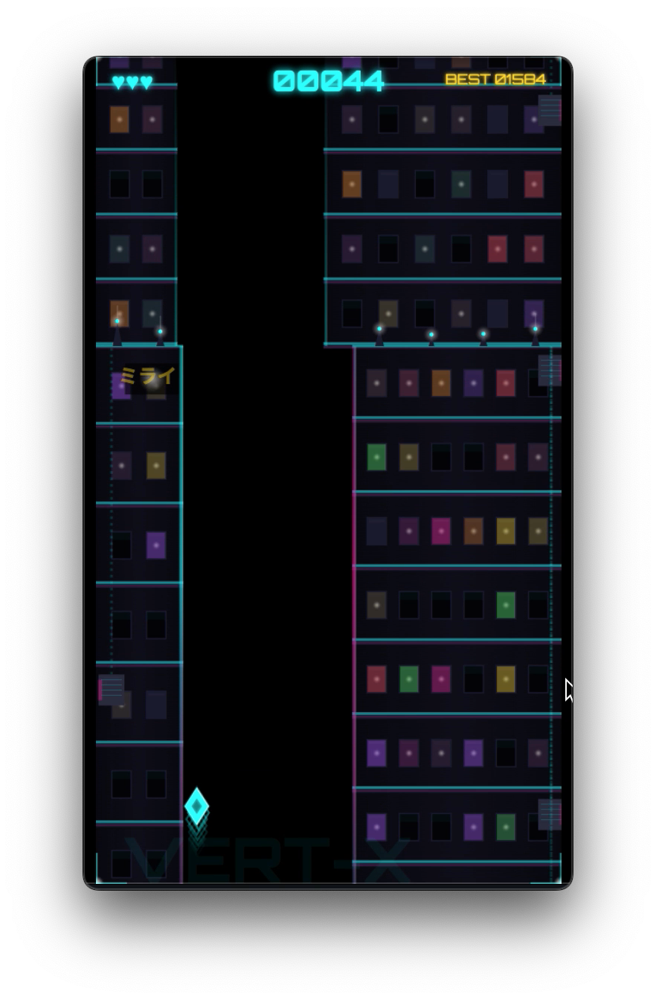
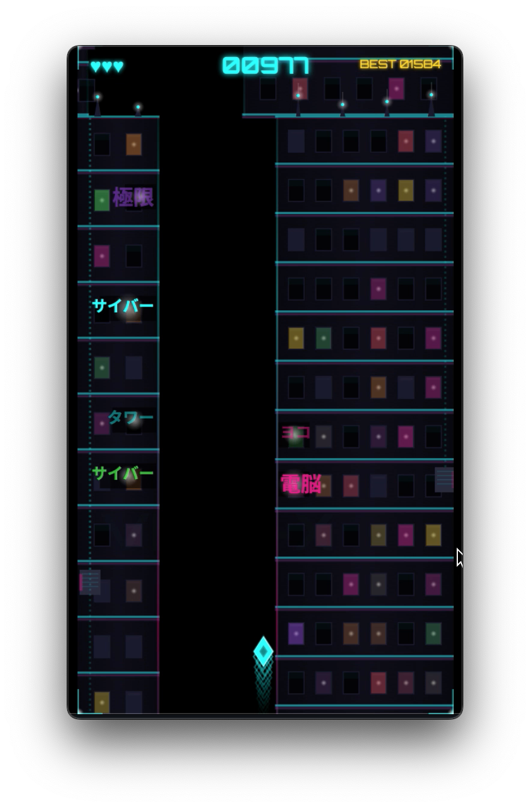
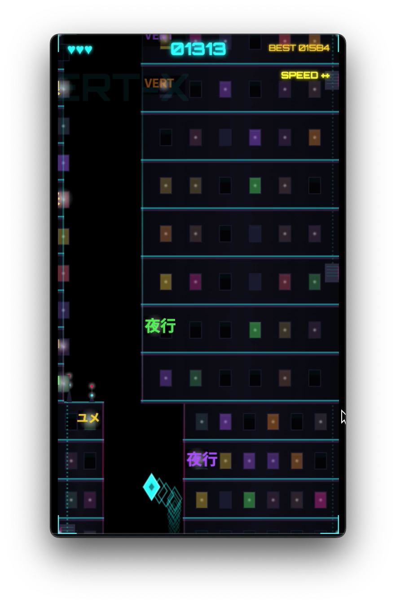
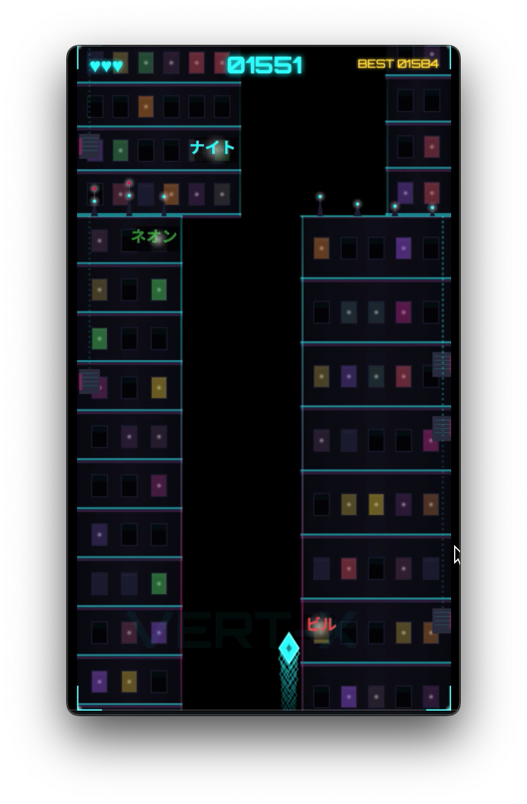
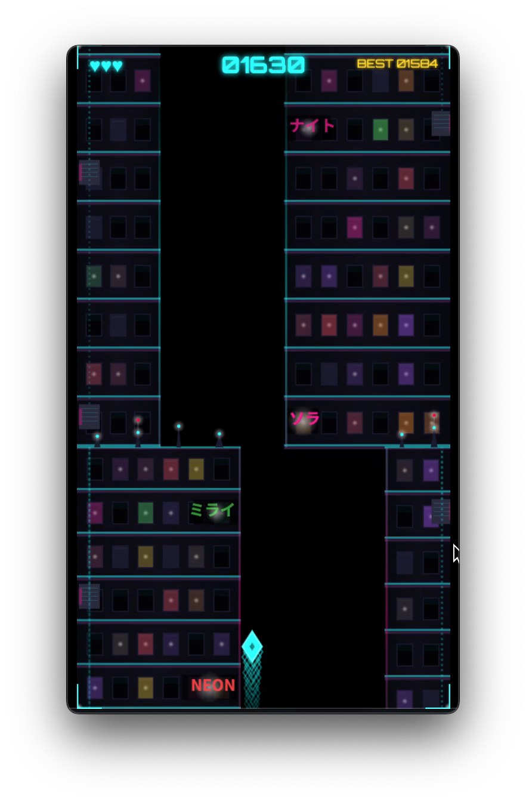
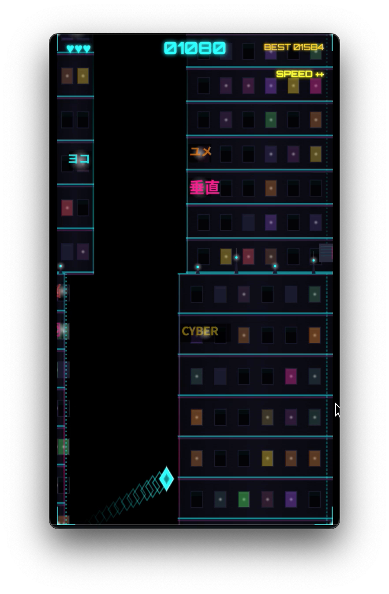
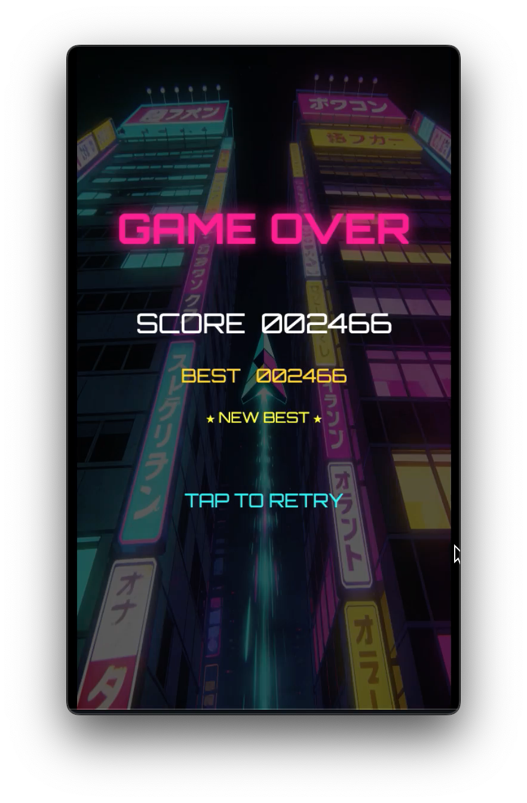

# VERT/X — Neon Tunnel Diver

> **Pixel‑art tunnel runner built for 60 FPS on mobile.**
> Vanilla JS + Canvas 2D + Vite. No frameworks. No runtime dependencies.


**[Play Now](https://vertx-five.vercel.app)** (Deployed on Vercel)

---

## Gameplay

Guide a diamond‑shaped diver through an infinite neon tunnel.
Collect coins, dodge walls and obstacles, survive as long as you can.
The tunnel gets faster, tighter, and more alive as your score climbs.

- **Mobile‑first**: touch anywhere to steer, one‑tap controls (also supports Space / ArrowUp)
- **Procedural generation**: every run is unique — building layouts, window patterns, neon signs, roof details
- **Pixel art aesthetic**: 360×640 logical resolution with crisp pixel rendering
- **Synth‑wave / cyberpunk vibe**: cyan + magenta neon strips, glowing windows, animated signs
- **Lives system**: 3 hearts, invulnerability frames on hit
- **Combo multiplier**: collect coins in quick succession for score multipliers
- **Persistent best score**: saved to localStorage across sessions

### Gallery

<table>
  <tr>
    <td></td>
    <td></td>
    <td></td>
    <td></td>
  </tr>
  <tr>
    <td></td>
    <td></td>
    <td></td>
  </tr>
</table>

### Gallery

<table>
  <tr>
    <td></td>
    <td></td>
    <td></td>
    <td></td>
  </tr>
  <tr>
    <td></td>
    <td></td>
    <td></td>
  </tr>
</table>

---

## Performance Optimisation

This project was diagnosed with **six performance killers** that caused dropped frames (30–45 FPS) on 3× DPR mobile devices. Each was systematically eliminated.

| # | Killer | Why It Hurt | Fix | Impact |
|---|--------|-------------|-----|--------|
| 1 | **Full DPR canvas** | 1080×1920 canvas = 6× more pixels than logical | Cap DPR at `min(devicePixelRatio, 1.5)` | **~75% fewer GPU pixels** |
| 2 | **`shadowBlur` everywhere** | Player glow, building windows, neon signs, roof spires, coins — each call forces a separate GPU render‑target | Replace all `shadowBlur` with a **glow cache** — 5 pre‑rendered radial gradients on offscreen canvases, drawn via `drawImage` | **~20 shadowBlur calls → 0** per frame |
| 3 | **Per‑frame `createLinearGradient`** | Building silhouettes, edge strips, gap strips — 18–20 gradient objects allocated every frame | Cache gradients on **building objects** (at generation time) and **chunk objects** (at gap‑strip creation) | **~20 gradient allocations → 0** per frame |
| 4 | **Unbatched trail** | Player trail drawn as 30–50 individual `fillRect` calls | Single `beginPath` + `moveTo`/`lineTo` + `stroke` per segment | **~40 draw calls → 2** per frame |
| 5 | **Coin glow** | Each coin used `shadowBlur(10)` plus coin‑pop effect and floating text | Replaced with glow cache (`drawGlow`) | **~10 shadowBlur calls → 0** per frame |
| 6 | **No culling** | Entire chunk rendered even when 2× off‑screen (above/below visible area) | Add `draw()` early‑return check at the top of the chunk render loop | **~30% fewer pixels drawn** per frame (worst case) |

**Result: 60 FPS sustained on target devices (3× DPR, 360×640 logical).**
All six fixes are independent and together cost ~100 lines of new code.

---

## Architecture

```
vertx/
├── index.html              # Entry point, mobile meta tags
├── vite.config.js          # Vite config (base: './', outDir: 'dist')
├── vercel.json             # Vercel deployment config
├── css/
│   └── style.css           # Neon theme, canvas container, responsive layout
├── js/
│   ├── main.js             # Game loop (fixed-timestep 60fps), state machine, init, resize
│   ├── config.js           # Visual luminosity/brightness controls (per light source)
│   ├── tunnel.js           # Chunk generation, building/roof/window logic, frustum culling
│   ├── player.js           # Diamond player physics, trail rendering, glow cache integration
│   ├── obstacles.js        # Obstacle spawning, types, rendering, off-screen cleanup
│   ├── collectibles.js     # Coin spawning, rendering, collection effects, combo logic
│   ├── collision.js        # Hit-detection: player vs walls, obstacles, and coins
│   ├── hud.js              # In-game HUD: score, lives (hearts), combo, speed indicator
│   ├── input.js            # Action-queue pattern: pointer + keyboard → single tap token
│   ├── storage.js          # localStorage wrapper for best score persistence
│   └── glow.js             # Glow cache module (5 pre-rendered radial gradient textures)
└── public/
    ├── loadingscreen.jpeg  # Game-over screen background
    ├── sprites/            # Player sprites (1.png – 8.png)
    └── screenshots/        # Gameplay screenshots for README
```

### Module Responsibilities

| Module | Purpose |
|--------|---------|
| **`main.js`** | Orchestrator. Owns the fixed‑timestep game loop (60 fps with accumulator), state machine (`MENU → PLAYING → GAME_OVER`), canvas setup with DPR capping, responsive scaling, and top‑level update/render dispatch. |
| **`config.js`** | Centralized luminosity multipliers for every light source (building windows, neon signs, AC vents, roof details, edge neons, gap neons, center text, corner brackets). Exposes `getLuminosity(source)` and `setLuminosity(source, value)`. |
| **`tunnel.js`** | Procedural chunk generation with cached gradients on every building (`baseGradient`, `edgeGradient`) and every chunk (`gapGradL`, `gapGradR`). Frustum culling skips chunks entirely when above/below visible area. |
| **`player.js`** | Diamond‑shaped player with horizontal direction flipping on tap. Batched trail path (single stroke instead of 30–50 rects), `drawGlow` instead of `shadowBlur` for player aura. Handles invulnerability frames after hits. |
| **`obstacles.js`** | Spawns obstacles inside tunnel passage (5 types: tiny, vertical, horizontal, medium, wide‑low). Biased to middle 60% of gap. Rendered with magenta neon glow. |
| **`collectibles.js`** | Coin spawning inside tunnel passage. Coin glow via `drawGlow`, coin‑pop effect and floating "+100" text glow via cache. |
| **`collision.js`** | Circle‑based hit detection. Checks player bounds against wall segments, obstacles, and coins. Returns collision result snapshot consumed by `main.js` to update lives/score/combo. |
| **`hud.js`** | Pure canvas HUD — hearts for lives, score counter, best score, combo multiplier display, flashing speed indicator at thresholds (1.5×, 2.0×, 2.5×). |
| **`input.js`** | Action‑queue pattern. Each frame the game loop calls `dequeueAction()` once, consuming one queued tap. Multiple rapid inputs collapse to a single action. Supports pointer and keyboard. |
| **`storage.js`** | Safe `localStorage` read/write for best score (`vertx_best` key). Degrades gracefully when localStorage is unavailable. |
| **`glow.js`** | Pre‑renders 5 radial gradients for radii [3, 6, 10, 15, 22] on offscreen canvases. Exports `drawGlow(ctx, x, y, radius, color)` with nearest‑radius lookup and single `drawImage` call. |

---

## Design Decisions

### Why Canvas 2D (not WebGL / Three.js)?

Pixel art benefits from **crisp nearest‑neighbour scaling**. Canvas 2D gives us sub‑pixel control and keeps the bundle under 15 KB gzip. Three.js would add 500+ KB for zero visual gain in this art style.

### Why DPR 1.5 (not 1.0 or 2.0)?

- 1.0 looks noticeably blurry on retina screens
- 2.0+ on a 3× phone = 3,240 × 1,920 GPU pixels = slow fill rates
- 1.5 preserves sharpness while reducing GPU work by ~75% vs uncapped

### Why gradient caching instead of pre‑rendered textures?

Building gradients depend on dynamic width (which varies per building). Caching them at generation time avoids per‑frame allocation without losing procedural flexibility. Gap gradients are always the same shape so they could be pre‑rendered, but caching on the chunk object is simpler and cost is one‑time.

### Why a glow cache instead of dropping glow entirely?

Glow is a core part of the aesthetic. Removing it would make the game look flat. The cache preserves the visual while eliminating the GPU cost of `shadowBlur`.

---

## Local Development

```bash
# Install dependencies (Vite)
npm install

# Start dev server with hot reload
npm run dev

# Build for production
npm run build

# Preview production build locally
npm run preview
```

---

## Deployment

Automatic deploys via Vercel (`vercel.json` in repo root).
Production URL: [https://vertx-five.vercel.app](https://vertx-five.vercel.app)

---

## License

MIT — do what you want with it.
